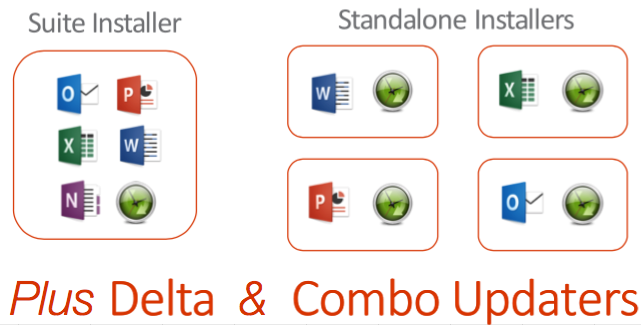

# microsoft-recipes
Unofficial (meaning not maintained by Microsoft) Office (and Microsoft-related) Recipes for AutoPkg

This repo contains update recipes for Lync(soon to be rebranded ~~Communicator~~ ~~Messenger~~ [SkypeForBusiness](https://support.office.com/en-us/article/Lync-is-now-Skype-for-Business-—-see-what-s-new-aba02d7e-c801-4a82-bccd-e7207240f612)), AutoUpdate 3.x (AKA MAU), and the Office 2016 suite. (OneNote can be obtained from the Mac App Store, so it is only partially included.)

###What the who?
These used to be located in the `autopkg/recipes` and `autopkg/arubdesu-recipes` repos, but they grew in number and variety to the point that it made sense to gather them all in one place.

These are more than just traditional 'update' recipes - while the original intention of autopkg was to grab updates by using mechanisms that are as-close-as-possible to the native polling an apps auto-update functionality would use, Office 2016 has many deployment permutations to consider. All of the products referenced above have 'combo' update flavored packages, which install the entire product. MAU and Lync are less of a concern, as they do not require licensing... but the story becomes interesting with Office 2016

- While Office 2016 can be deployed in many ways, it comes in several different flavored installers:
	- Standalone, meaning each individual product install has a bundled version of MAU
	- Volume Licensed, per-product or full suite installers
	- 'Combo' updates, similar to how Lync updates are full, potentially-installable versions
	- 'Delta' updates, which are slated for release with 15.19
- And finally, there is the new concept of a 'SKU-Less' installer, meaning a version of the suite that can be installed (except in an AutoDMG workflow) and licensed for O365 or [volume licensing](https://clburlison.com/demystify-office2016/#vl-serializer) after the fact.

Besides the VL suite installer and the SKU-Less version, the Standalone flavor can also be licensed because it contains the proper support files.

###All the things!
Like Pokemon, we've gotta catch them all. Contained in this repo is a custom autopkg processor that allows you to fetch standalone, combo, or delta flavors of the Office 2016 apps, and recipes that can be customized via [overrides](https://github.com/autopkg/autopkg/wiki/FAQ#can-i-change-a-recipe-to-do-x-instead-of-y-do-i-use-overrides-for-that) to grab the one(s) you want. This functionality was enabled by @ftiff by adapting code worked on by @tvsutton, @arubdesu, and originally authored by @gregneagle. 

A separate set of recipes operate on the SKU-Less suite. The included Office2016-IndividualApps/JSS-README.md describes a workflow for deploying the 2016 apps (which require you to override the MSVERSION key to be 'Standalone') along with policy templates that even enable it to be licensed if you supply the 15.17+ bundled 'VL Serializer' package.
